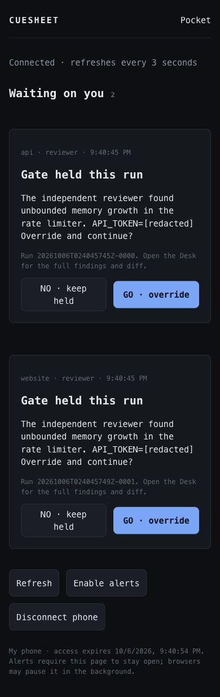

# Pocket

Pocket is the phone view for pending permissions and Gate Holds across every
project in the running daemon. It uses the Desk's existing standby mechanism:
GO allows or overrides; NO denies or keeps the run held. It cannot start a run,
change configuration, read the Commons, browse files or retrieve run logs and
patches. Open the Desk when a decision needs the full findings and diff.

## Connect a phone

Use the current source build or development prerelease
[`build-37505975254-d92b689`](https://github.com/npyrz/Cuesheet/releases/tag/build-37505975254-d92b689).
The named `v0.1.0-alpha` installers do not contain Pocket.

1. Build and run Cuesheet with `npm run build` and either the desktop app or
   `npx cuesheetd`. For the browser Desk, also run the UI development server.
2. Install [Tailscale](https://tailscale.com/download) on the computer and
   phone and connect both to your own tailnet.
3. On the computer, configure private HTTPS serving:

   ```bash
   tailscale serve --bg --https=443 http://127.0.0.1:7374
   ```

   Follow Tailscale's HTTPS setup if prompted. Copy the machine's HTTPS URL
   from the output, such as `https://computer.tail123.ts.net`.
   [Tailscale Serve](https://tailscale.com/docs/reference/tailscale-cli/serve)
   restricts this service to your tailnet and terminates HTTPS before proxying
   to loopback. Cuesheet does not install Tailscale or modify its settings.
4. In the local Desk, open **Pocket** (also available on the project launcher
   and in the command palette). Enter that HTTPS URL and select **Enable
   Pocket**. Until this point port 7374 has no Cuesheet listener.
5. Select **Generate pairing QR**, scan it with the phone camera, name the
   phone and select **Pair phone**. The link expires after two minutes and
   works once. A replacement QR invalidates the previous link. **Cancel
   pairing link** invalidates it immediately.
6. Keep the phone page open. It refreshes every three seconds, reconnects on
   returning to the page, and offers GO/NO for each current question. Answers
   to a question already answered, stopped or abandoned are refused.

If another service already uses HTTPS port 443 on this Tailscale machine, use
an available HTTPS port, for example `--https=8443`, and enter the matching URL
with `:8443` in Pocket. Review existing Serve configuration before changing it.
The panel shows the command matching the saved origin and actual Pocket port.
Use Serve for this private service. Do not forward the Desk API on port 7373.

Device access expires 24 hours after pairing. The phone stores its bearer
credential in browser **session storage**, so reloads in the same tab work;
closing the tab or clearing browser storage may require another QR. Credentials
are sent in Authorization headers, never query parameters. The QR's secret is
in a URL fragment, removed from the address bar before the page starts pairing.

The Desk lists unexpired devices. **Revoke** removes one device immediately;
**Disable Pocket** cancels invitations, revokes every device and closes the
phone listener. Changing the saved HTTPS origin also revokes all devices and
invitations. **Disconnect phone** revokes that phone before clearing its local
session. Disabling Pocket does not change Tailscale's independently managed
Serve settings; with the listener closed, its old proxy target is unavailable.

## Alerts and delivery

**Enable alerts** requests browser notifications where supported and attempts
vibration for new questions. Notification text is generic; it does not put the
question or project on the lock screen. The standby list itself remains usable
without notification permission.

This is foreground delivery. Mobile browsers can suspend background pages,
and some permit notifications only through installed applications or service
workers. Pocket has no background push service, relay, guaranteed lock-screen
buzz, or offline answer queue. Reopen the page to read the current questions;
an answer is successful only after the daemon accepts it.

## Boundaries and state

The unauthenticated Desk API must bind to loopback. Pocket is a **second
listener in the same daemon**, also on loopback, enabled explicitly on port
7374. It serves only the built UI assets and these phone endpoints:

| Method | Phone route | Purpose |
|---|---|---|
| `POST` | `/api/pocket/pair` | Exchange the one-time pairing secret and phone name for a 24-hour credential. |
| `GET` | `/api/pocket/standbys` | Authenticated, redacted pending questions across projects. |
| `POST` | `/api/pocket/standbys/:id` | Authenticated `{ "answer": "go" }` or `{ "answer": "no" }`. |
| `DELETE` | `/api/pocket/session` | Revoke the authenticated phone. |

Mutations require the configured HTTPS Origin; foreign origins are refused.
Invalid credential attempts are bounded without blocking already paired
phones. API responses are not cached, and the phone shell prevents framing
and referrer disclosure. Sourcemaps are not served by the phone listener.

The **local** listener additionally provides `/api/pocket/settings` (`GET`,
`POST` with `{ "origin": "https://…ts.net" }`, `DELETE`),
`/api/pocket/invitation` (`POST`, `DELETE`) and
`/api/pocket/devices/:id` (`DELETE`). These management routes never exist on
the phone listener. Local mutations require JSON and reject foreign browser
origins; local processes remain trusted, as they are for the rest of the Desk.
Use `Content-Type: application/json` and an empty object for bodyless local
mutations. Settings and management responses contain no device credentials.

`~/.cuesheet/pocket.json` is versioned installation state, independent of a
project's `cuesheet.toml`. It persists the enabled origin and hashed device
credentials with expiry; raw credentials and pairing invitations are never
written there. Writes are atomic and owner-readable on POSIX; Windows uses
the user's profile ACLs. Devices survive daemon restarts until expiry or
revocation. Invitations are memory-only and die on restart. Corrupt/newer
state or an unavailable port disables Pocket with a local status error while
the Desk keeps running. An unreadable file is never silently overwritten.

Phone summaries omit workspace roots, prompts, logs and patches. A bounded
text redactor removes recognized API tokens, bearer credentials, password or
secret assignments, authenticated URLs and private keys from questions and
names. Arbitrary sensitive prose and unknown secret formats cannot be detected
reliably; review what questions your harness and Gates emit. This is not the
broader pre-vendor redaction pack or an independent security audit.

## Verification

The automated suite exercises actual HTTP listeners and project queues:
single-use/expired QR exchanges, concurrent exchanges, persisted hashed
sessions, expiry/revocation/restart, cross-project questions, GO/NO, stale and
malformed answers, origin rejection, disabled access, and excluded API routes.

The built UI was driven on macOS at a 390 × 844 browser viewport using a
disposable profile and a loopback proxy simulating the HTTPS terminator:
pair, read two questions, GO, NO, generate a QR, revoke from the Desk, then
reload the phone to observe the refusal. The image below contains synthetic
questions from that profile. No real Tailscale connection or physical phone
was exercised. Automated checks and unsigned packaging passed on macOS and
Windows for `d92b689` in Release run 37505975254; Windows UI, physical-phone
alerts and tailnet HTTPS acceptance remain recorded in [the plan](../PLAN-STEP.MD#phase-15--pocket).


