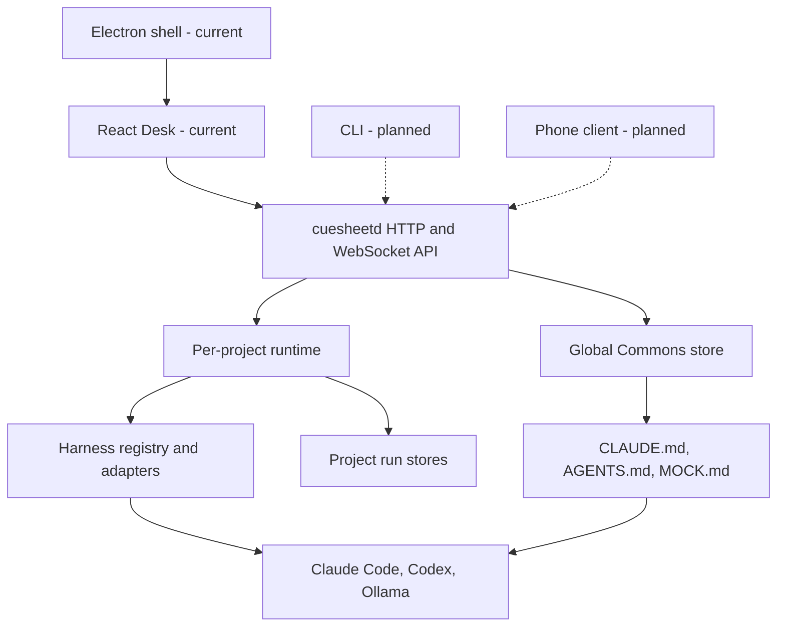

# Cuesheet system design

These pages describe the architecture that exists in the current source tree. They are a map for contributors, not a replacement for the build plan or product documentation.

The project is on the **beta development track**, but the latest published release is still `v0.1.0-alpha`. In the diagrams:

- **Current** means implemented in this repository.
- **Planned** means described in `PLAN-STEP.MD` or the product roadmap but not implemented yet.

## Read this in order

1. [Architecture and components](architecture.md) — the daemon-first shape and package boundaries.
2. [Run lifecycle and gates](runs-and-gates.md) — how a prompt becomes a durable, reviewed run.
3. [Projects, data, and storage](projects-and-storage.md) — project isolation and the on-disk model.
4. [Harnesses and limits](harnesses-and-limits.md) — the runtime adapter seam, usage, and fallback routing.
5. [The Commons and projections](commons-and-projections.md) — shared facts and generated context files.
6. [Desktop, API, and events](clients-api-and-events.md) — clients, routes, reconnects, and Electron.

## One-screen map

Solid lines are current. Dashed lines are planned client paths.

## Sources of truth

- `README.md` is the product contract and the honest feature inventory.
- `PLAN-STEP.MD` is the implementation status of record.
- `packages/core` owns shared domain and wire types.
- `packages/daemon/src/server.ts` owns the public HTTP and WebSocket surface.
- `packages/harness/src/types.ts` owns the harness contract.
