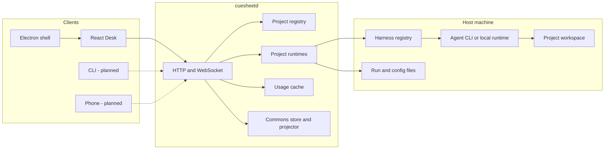
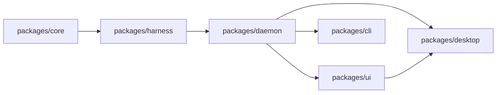
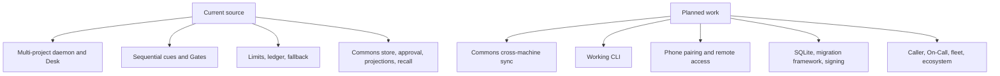

# Architecture and components

## Design center

The daemon is the product. The Desk, Electron shell, future CLI, and future phone are clients of the same HTTP and WebSocket API. Product behavior belongs behind that API; Electron is packaging and native integration, not a second backend.

The daemon currently binds to `127.0.0.1:7373`. It is intentionally unauthenticated while it is loopback-only. Network serving, pairing, revocation, and phone access are planned and must add an authentication boundary before widening exposure.

## Package dependency direction

Dependencies point in one direction. UI and Electron consume the daemon contract; the daemon adapts harnesses; harnesses consume core vocabulary.

The arrows mean “is depended on by.” The important boundary is that `core` has no process-running concerns, and harnesses do not import the daemon. `packages/daemon/src/harness-executor.ts` is the composition adapter that knows both sides without creating a cycle.

| Package | Current responsibility |
|---|---|
| `core` | Domain and wire types, config schemas, roles, leashes, gates, limits, project registry, Commons fact format, paths |
| `harness` | Harness interface, registry, process/workspace helpers, built-in `mock`, `claude-code`, `codex`, and `ollama` adapters |
| `daemon` | API, project runtimes, queues, execution, event buses, run storage, usage cache, Commons storage, projection and MCP recall |
| `ui` | Responsive React Desk; project, run, limits, ledger, and first-run surfaces |
| `desktop` | Electron lifecycle, daemon ownership/attachment, preload bridge, tray, notifications, native folder picker |
| `cli` | Empty package today; a real client is planned for Phase 13 |

## Current and planned boundary

The UI is already responsive, but that is not the same as having a phone client. Likewise, the CLI package exists, but its command surface does not.
