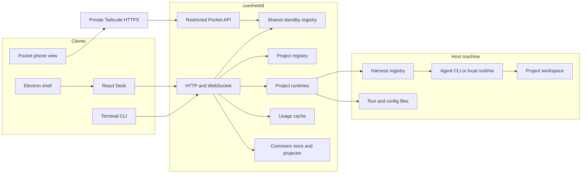
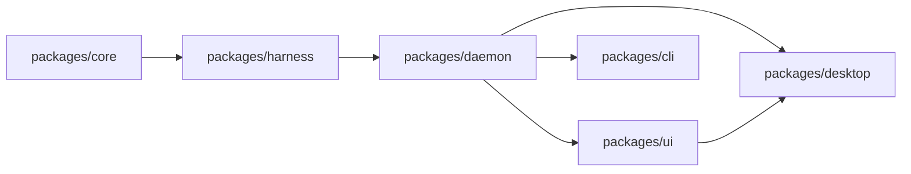
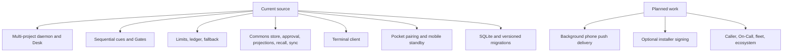

# Architecture and components

## Design center

The daemon is the product. The Desk, Electron shell, terminal CLI, and Pocket phone view are HTTP clients of the same backend. Product behavior belongs behind that API; Electron is packaging and native integration, not a second backend.

The unrestricted Desk API binds to loopback on port 7373 and refuses non-loopback hosts. Optional Pocket uses a second loopback listener on port 7374, exposing only authenticated standby reads/answers behind operator-managed Tailscale HTTPS. Its pairing, expiry and revocation boundary is described in [Pocket](../pocket.md).

```mermaid
flowchart LR
    subgraph Clients
        Desk[React Desk]
        Shell[Electron shell]
        CLI[Terminal CLI]
        Phone[Pocket phone view]
    end

    subgraph Daemon[cuesheetd]
        API[HTTP and WebSocket]
        Pocket[Restricted Pocket API]
        Standbys[Shared standby registry]
        Registry[Project registry]
        Runtimes[Project runtimes]
        Usage[Usage cache]
        Memory[Commons store and projector]
    end

    subgraph Host[Host machine]
        Harness[Harness registry]
        Vendor[Agent CLI or local runtime]
        Repo[Project workspace]
        Disk[Run and config files]
    end

    Shell --> Desk
    Desk --> API
    CLI --> API
    Phone --> Tailnet[Private Tailscale HTTPS]
    Tailnet --> Pocket
    Pocket --> Standbys
    API --> Standbys
    API --> Registry
    API --> Runtimes
    API --> Usage
    API --> Memory
    Runtimes --> Harness
    Harness --> Vendor
    Vendor --> Repo
    Runtimes --> Disk
```

## Package dependency direction

Dependencies point in one direction. UI and Electron consume the daemon contract; the daemon adapts harnesses; harnesses consume core vocabulary.

```mermaid
flowchart LR
    Core[packages/core]
    Harness[packages/harness]
    Daemon[packages/daemon]
    UI[packages/ui]
    CLI[packages/cli]
    Desktop[packages/desktop]

    Core --> Harness
    Harness --> Daemon
    Daemon --> UI
    Daemon --> CLI
    Daemon --> Desktop
    UI --> Desktop
```

The arrows mean “is depended on by.” The important boundary is that `core` has no process-running concerns, and harnesses do not import the daemon. `packages/daemon/src/harness-executor.ts` is the composition adapter that knows both sides without creating a cycle.

| Package | Current responsibility |
|---|---|
| `core` | Domain and wire types, config schemas, roles, leashes, gates, limits, project registry, Commons fact format, paths |
| `harness` | Harness interface, registry, process/workspace helpers, built-in `mock`, `claude-code`, `codex`, and `ollama` adapters |
| `daemon` | API, project runtimes, queues, execution, event buses, run storage, usage cache, Commons storage, projection, MCP recall, and Git sync |
| `ui` | Responsive React Desk; project, run, limits, ledger, and first-run surfaces |
| `desktop` | Electron lifecycle, daemon ownership/attachment, preload bridge, tray, notifications, native folder picker |
| `cli` | Terminal client for project registration, Station discovery, runs, and standbys |

## Current and planned boundary

```mermaid
flowchart TB
    Current[Current source]
    Planned[Planned work]

    Current --> C1[Multi-project daemon and Desk]
    Current --> C2[Sequential cues and Gates]
    Current --> C3[Limits, ledger, fallback]
    Current --> C4[Commons store, approval, projections, recall, sync]

    Current --> C5[Terminal client]

    Current --> C6[Pocket pairing and mobile standby]
    Current --> C7[SQLite and versioned migrations]
    Planned --> P1[Background phone push delivery]
    Planned --> P2[Optional installer signing]
    Planned --> P3[Caller, On-Call, fleet, ecosystem]
```

Pocket reuses the built UI with its own focused phone page. Actual tailnet/physical-phone acceptance remains open; the source is verified over HTTP and in a phone-width browser walkthrough.
