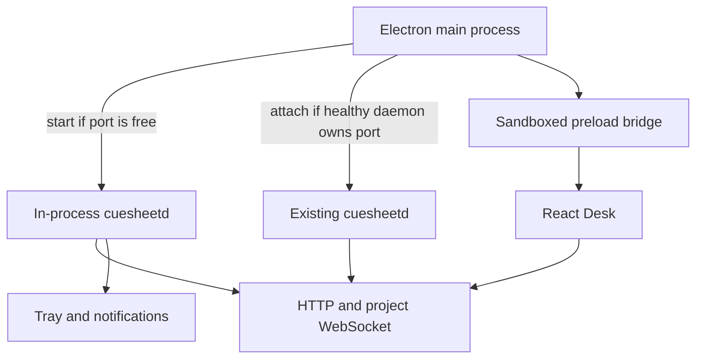
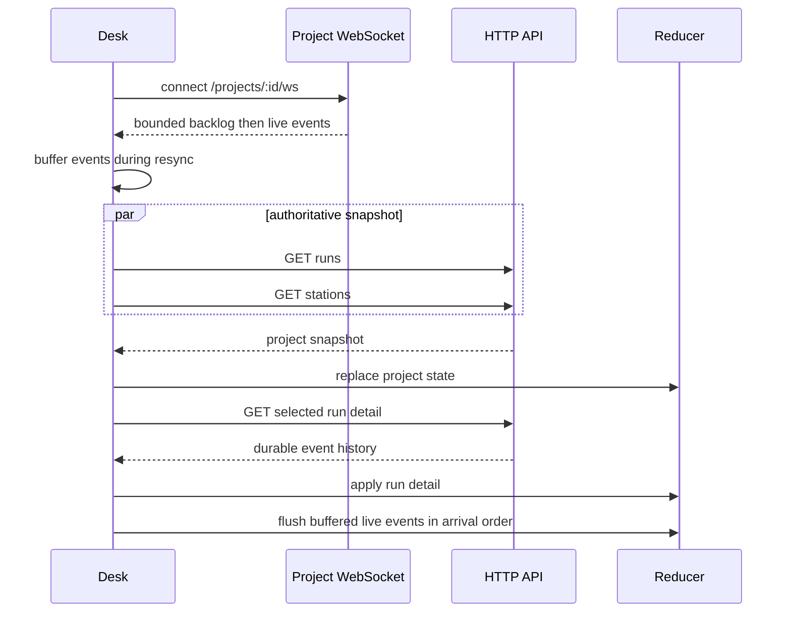

# Desktop, API, and events

## Client topology

Electron starts the real harness runtime in-process. If port `7373` already belongs to a healthy Cuesheet daemon, the shell attaches to it and does not own or stop it. The renderer receives only a small preload bridge for API location, folder selection, platform details, and active-project display.

The shell's direct access to the in-process global event bus is only for native notifications. The Desk always uses the network contract. When attached to an external daemon, the shell currently has no native notification stream, while the Desk still receives project events over WebSocket.

## Current routes

The daemon registers the same surface at the root and under `/api`. The table
uses the root form; the browser development server normally reaches it through
the `/api` prefix.

| Scope | Route | Purpose |
|---|---|---|
| Global | `GET /health` | Liveness and daemon version |
| Global | `GET /usage` | Harness plan windows |
| Global | `GET /commons` | List facts |
| Global | `GET /commons/history` | Git-backed history or a reason it is unavailable |
| Global | `GET /commons/:id` | Read one fact |
| Global | `POST /commons` | Write a fact and regenerate projections |
| Global | `DELETE /commons/:id` | Delete a fact and regenerate projections |
| Global | `GET /projects` | List registered projects |
| Global | `POST /projects` | Open or register a project |
| Global | `POST /standbys/:id` | Answer `go` or `no` |
| Project | `GET /projects/:id` | Project detail |
| Project | `DELETE /projects/:id` | Forget registry entry without deleting files |
| Project | `GET /projects/:id/stations` | Stations, probes, cuesheets, limits, warnings |
| Project | `POST /projects/:id/stations` | Add a Station and reload config |
| Project | `GET /projects/:id/runs` | List run summaries |
| Project | `POST /projects/:id/runs` | Validate and enqueue a run |
| Project | `GET /projects/:id/runs/:runId` | Run record and event history, excluding patch bytes |
| Project | `GET /projects/:id/runs/:runId/diff` | Fetch the patch on demand |
| Project | `POST /projects/:id/runs/:runId/stop` | Stop queued or active work |
| Project | `GET /projects/:id/ledger` | Project spend aggregation |
| Project | `GET /projects/:id/ws` | Project-only event stream and bounded replay |

All current routes are loopback-only and unauthenticated. A future remote client cannot safely reuse that deployment posture unchanged.

## Live events and reconnect

The wire event is a discriminated union: status, text, tool, file, standby, denial, cost, verdict, done, or error. Every event carries a run id and timestamp; Station-specific variants also carry a Station id.

The replay buffer is a convenience, not the authority. On each socket open the Desk fetches durable runs and Station state, buffers events arriving during that fetch, installs the snapshot, then replays the buffer. It uses a project-switch epoch so a slow response from the project just left cannot overwrite the one now visible.

Unknown run ids seen in live events are adopted with `GET /runs/:runId`; this supports work started by another client. Project switching closes one subscription and opens another but sends no stop or active-project mutation to the daemon.

## Native-only responsibilities

Electron owns native lifecycle and presentation: single-instance behavior, window creation, close-to-tray behavior, start-at-login, notifications, native folder selection, and clean shutdown of a daemon it owns. Starting runs, adding Stations, listing projects, and answering standbys remain API operations.

## Planned clients

The command-line client and phone client are planned. Phone pairing, tailnet or LAN serving, push, and device revocation do not exist yet. The current responsive Desk reduces future UI work but does not provide those transport and security features.
