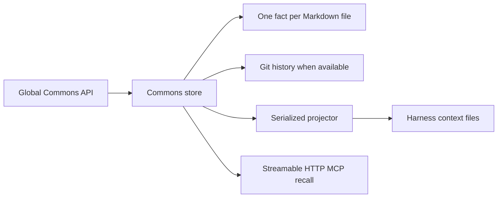
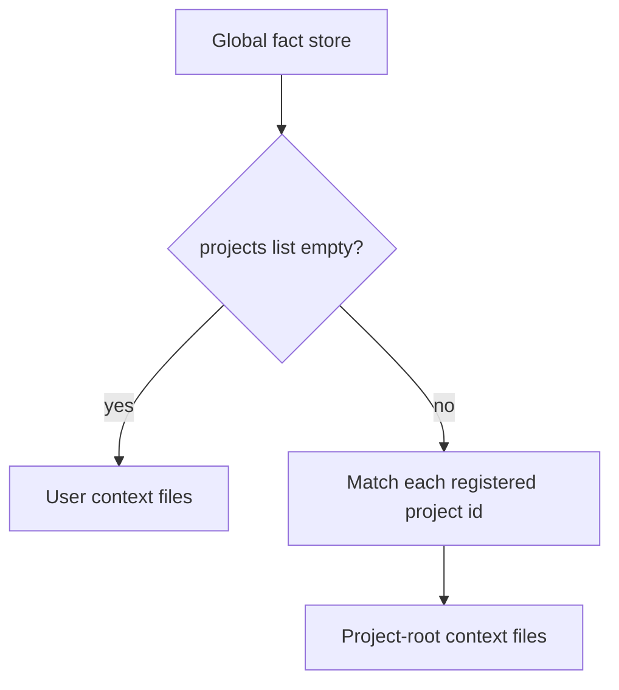
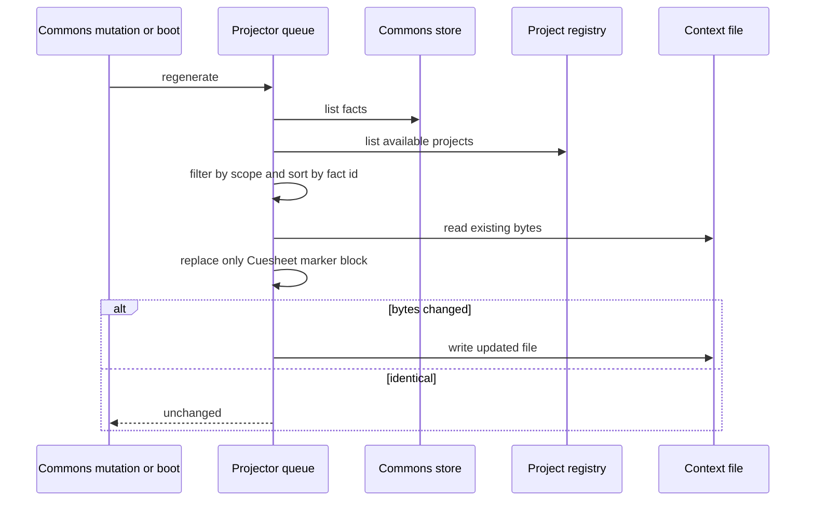
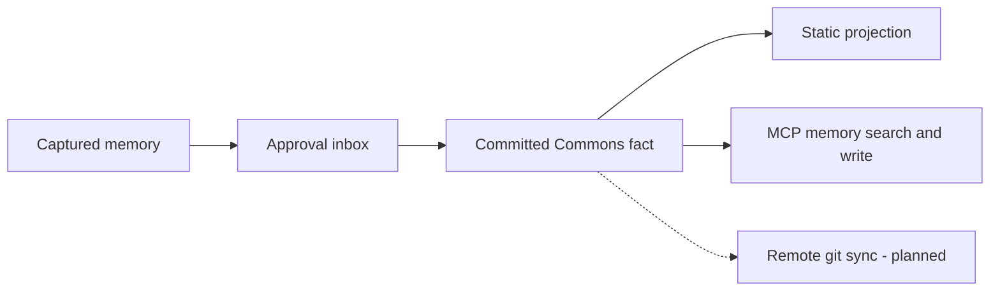

# The Commons and projections

## What exists now

The Commons is one global directory at `~/.cuesheet/commons`. Each fact is a Markdown file with TOML frontmatter. The store can read, list, write, delete, and report history. Mutations try to commit through git with a Cuesheet-specific identity and report whether the commit succeeded.

Git is optional at runtime. If it is unavailable, fact files are still written and the API reports that history was not recorded. The store remains readable with ordinary filesystem and git tools.

## Fact scope

A fact with no project ids belongs to the user layer. A fact with project ids belongs only to those projects. An empty project list is not a wildcard copied into every repository.

Current targets come from live `Harness.contextFiles` declarations rather than a daemon-owned filename list:

- Claude Code: `<project>/CLAUDE.md` and `~/.claude/CLAUDE.md`;
- Codex: `<project>/AGENTS.md` and `~/.codex/AGENTS.md`;
- mock: `<project>/MOCK.md`;
- Ollama: no always-loaded file, so the executor assembles approved user and
  project facts into its brief.

## Safe, stable projection

Generated content lives between `<!-- cuesheet:begin -->` and `<!-- cuesheet:end -->`. Everything outside that pair is preserved byte for byte. A missing pair is appended; incomplete or duplicate markers cause an error instead of a guess. Targets must remain beneath their declared user or project root.

Projection work is serialized so adjacent writes cannot finish out of order and resurrect deleted content. Output has deterministic ASCII-id ordering, no timestamps, and no run-specific noise. An identical projection is not rewritten, protecting both clean diffs and prefix-based prompt caches.

## Lifecycle

Regeneration currently happens after Commons mutations, at daemon boot, and when a new project is opened. Missing project roots are skipped rather than recreated.

## Recall and capture

The daemon serves stateless Streamable HTTP MCP at `/mcp`. Claude Code and
Codex register it through their own CLI configuration commands. `memory_search`
can search a project's user-plus-project scope or, when the project is omitted,
the global operator-owned store. `memory_write` requires project, Station, and
Run provenance and enters the same `inbox` or `auto` approval path as the HTTP
capture route.

Cross-machine git sync is still planned.
