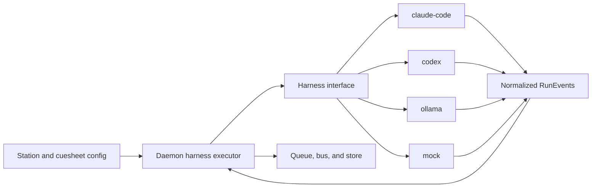
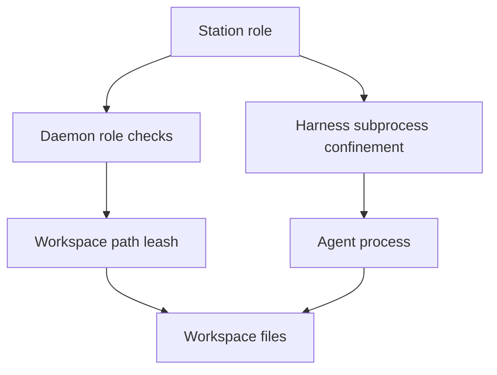
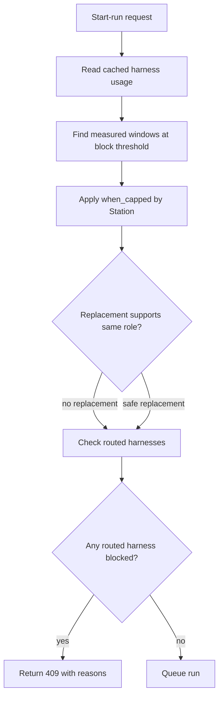

# Harnesses and limits

## The central seam

A harness translates one agent runtime into the small contract Cuesheet needs. It does not know about the Desk, project routes, queues, Gates, or storage.

The current interface provides:

- identity: `id`, `vendor`, supported `roles`;
- availability: `probe()`;
- plan information: `usage()`;
- always-loaded memory targets: `contextFiles`;
- future connector registration seam: `writeConnectors()`;
- execution: `run(ctx)`;
- optional role-specific subprocess confinement.

The run context contains only the Station, assembled brief, leashed workspace, event emitter, meter, standby callback, and abort signal. It deliberately omits the daemon bus, store, full config, and other Stations.

## Built-in harnesses

| Harness | Vendor | Roles | Context files | Current status |
|---|---|---|---|---|
| `mock` | Cuesheet | engineer, reviewer, worker | project `MOCK.md` | Development/demo harness |
| `claude-code` | Anthropic | engineer, reviewer, caller | project `CLAUDE.md`, user `.claude/CLAUDE.md` | Real runs |
| `codex` | OpenAI | engineer, reviewer, caller | project `AGENTS.md`, user `.codex/AGENTS.md` | Real runs |
| `ollama` | Ollama/local | worker | none | Real local worker runs |

Caller behavior is planned even though the two remote harnesses declare that they can occupy the seat. Gemini CLI, OpenCode, Cursor CLI, and LM Studio are roadmap entries, not current implementations.

## Enforcement layers

The leash checks paths observed through the harness workspace API. It cannot inspect arbitrary writes hidden inside a shell command. That is why supported harnesses also set native sandbox flags where available. The Desk reports which layer enforces each claim instead of treating all reviewer seats as equally confined.

## Usage, limits, and fallback

Usage is machine/vendor scoped, while spend is project scoped. The usage cache calls every registered harness, bounds each read with a timeout, never throws to its caller, and caches readings briefly. Its wire type preserves four distinct answers: `measured`, `not-blocked`, `unmetered`, and `unknown`.

Routing happens before the pre-run limit check so a valid fallback can rescue the run. It never swaps seats: a worker cannot replace a reviewer, and a harness with unknown role support cannot be assumed safe. Only a measured window blocks; unknown, unmetered, and not-blocked states do not invent a cap.

At execution time, the daemon records the Station, harness, vendor, cost, duration, and any substitution. Gate vendor counts use the harnesses that actually acted, not the written cuesheet.
