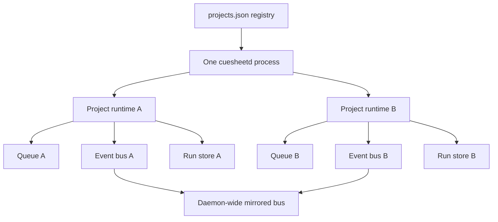
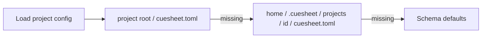

# Projects, data, and storage

## One daemon, many isolated runtimes

The daemon has no active project. A client selects a project by putting its id in the route. Switching the Desk changes the client subscription; it does not stop or retarget work.



Project runtimes are lazy and memoized by the in-flight construction promise. Concurrent first requests therefore share one queue and one store rather than racing to create duplicate runtime state. Reconciliation runs when a project is first touched.

Each project event bus owns its own replay buffer. The daemon-wide bus receives a mirror of all project events for native notifications and tests; a project client must use `/projects/:id/ws`.

## Configuration lookup

For a project, configuration resolves nearest-first:



The fallback file lets the Desk configure a project without modifying its repository. A project-root config wins when both exist.

## Current on-disk layout

```text
~/.cuesheet/
├── projects.json
├── daemon.json
├── commons/
│   ├── .git/
│   ├── .gitattributes
│   └── <fact-id>.md
└── projects/
    └── <project-id>/
        ├── cuesheet.toml
        └── runs/
            ├── runs.db
            └── <run-id>/          (written by the file store)
                ├── run.json
                ├── events.jsonl
                └── diff.patch
```

Project roots and their optional `cuesheet.toml` files live wherever the user opened them. Context projections also land in those roots; see [The Commons and projections](commons-and-projections.md).

## Ownership and durability

| Data | Scope | Authority | Important property |
|---|---|---|---|
| Project registry | Machine | `projects.json` | Recency ordered; forgetting never deletes the project folder |
| Project config | Project | nearest `cuesheet.toml` | Loaded per runtime and reloadable |
| Queue | Project process lifetime | `ProjectRuntime` | One active run per project |
| Run summary | Project | `runs.db`, or `run.json` | One row per run; the file store replaces the JSON atomically |
| Event history | Run | `runs.db`, or `events.jsonl` | Insert per event; the file store appends and ignores a truncated tail |
| Patch | Run | `runs.db`, or `diff.patch` | Stored apart from the run row because it may be large |
| Usage window | Machine/vendor | in-memory cache | Bounded reads; unknown stays explicit |
| Commons | Machine | git-backed Markdown | Global facts with project tags |

## Two run stores, one contract

`RunStore` has two implementations, and `RUN_STORE_CONTRACT` in the daemon is the executable definition both are held to; each is also tested for the properties only it can have.

| | SQLite (`runs.db`) | Files (`<run-id>/`) |
|---|---|---|
| Selected by | default | `CUESHEET_RUN_STORE=files` |
| Implementation | `node:sqlite`, built into Node 22.13+; no native module | `node:fs` |
| Listing a page of runs | index scan of the requested rows | `readdir` of the project's history, then one read per row |
| Finding runs stranded by a crash | indexed query, at any age | newest-first scan of a bounded window |
| Ending a run | final state and patch in one transaction | atomic replacement of `run.json`, then a separate patch write |
| Read without Cuesheet | any SQLite client | `cat` |

The first open of a project under SQLite imports the run directories already there and leaves them in place, so the file store remains a working choice afterwards. A database whose `user_version` is newer than the build refuses to open rather than being written to by an older Cuesheet; that refusal is the half of Phase 13's migration mechanism that prevents damage, and the rest — versioned config, recorded migrations, released profiles exercised in CI — is still planned.
