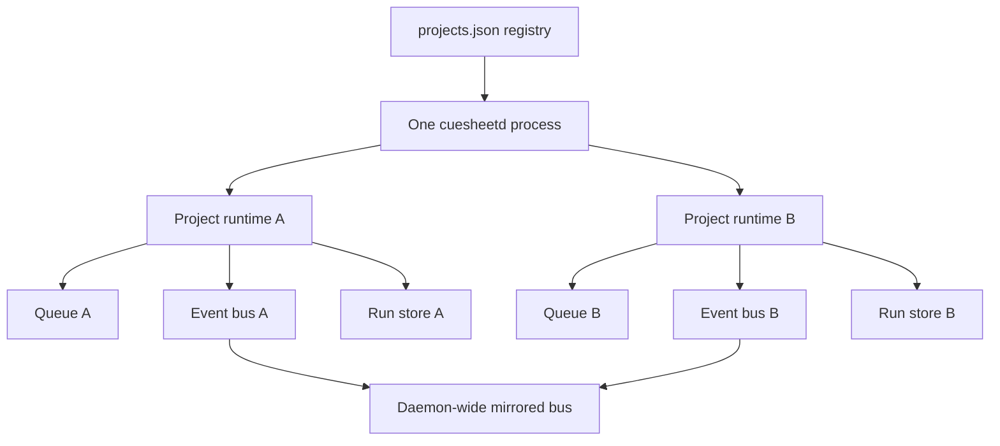
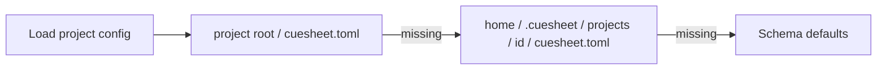

# Projects, data, and storage

## One daemon, many isolated runtimes

The daemon has no active project. A client selects a project by putting its id in the route. Switching the Desk changes the client subscription; it does not stop or retarget work.



Project runtimes are lazy and memoized by the in-flight construction promise. Concurrent first requests therefore share one queue and one store rather than racing to create duplicate runtime state. Reconciliation runs when a project is first touched.

Each project event bus owns its own replay buffer. The daemon-wide bus receives a mirror of all project events for native notifications and tests; a project client must use `/projects/:id/ws`.

## Configuration lookup

For a project, configuration resolves nearest-first:



The fallback file lets the Desk configure a project without modifying its repository. A project-root config wins when both exist.

## Current on-disk layout

```text
~/.cuesheet/
├── projects.json
├── daemon.json
├── commons/
│   ├── .git/
│   ├── .gitattributes
│   └── <fact-id>.md
└── projects/
    └── <project-id>/
        ├── cuesheet.toml
        └── runs/
            └── <run-id>/
                ├── run.json
                ├── events.jsonl
                └── diff.patch
```

Project roots and their optional `cuesheet.toml` files live wherever the user opened them. Context projections also land in those roots; see [The Commons and projections](commons-and-projections.md).

## Ownership and durability

| Data | Scope | Authority | Important property |
|---|---|---|---|
| Project registry | Machine | `projects.json` | Recency ordered; forgetting never deletes the project folder |
| Project config | Project | nearest `cuesheet.toml` | Loaded per runtime and reloadable |
| Queue | Project process lifetime | `ProjectRuntime` | One active run per project |
| Run summary | Project | `run.json` | Atomic replacement |
| Event history | Run | `events.jsonl` | Append-only; truncated tail is ignored |
| Patch | Run | `diff.patch` | Loaded separately because it may be large |
| Usage window | Machine/vendor | in-memory cache | Bounded reads; unknown stays explicit |
| Commons | Machine | git-backed Markdown | Global facts with project tags |

## Current versus planned storage

The file-backed `RunStore` is current and remains behind an interface. Phase 13 plans a SQLite implementation for large histories while retaining the file store contract, plus versioned migrations that refuse state written by a newer build. Those mechanisms are not implemented yet.
