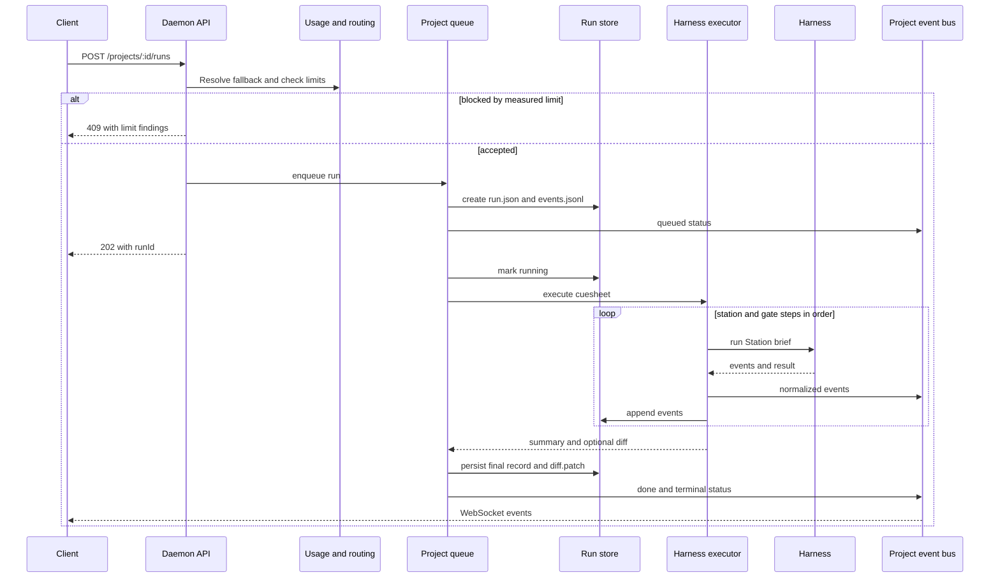
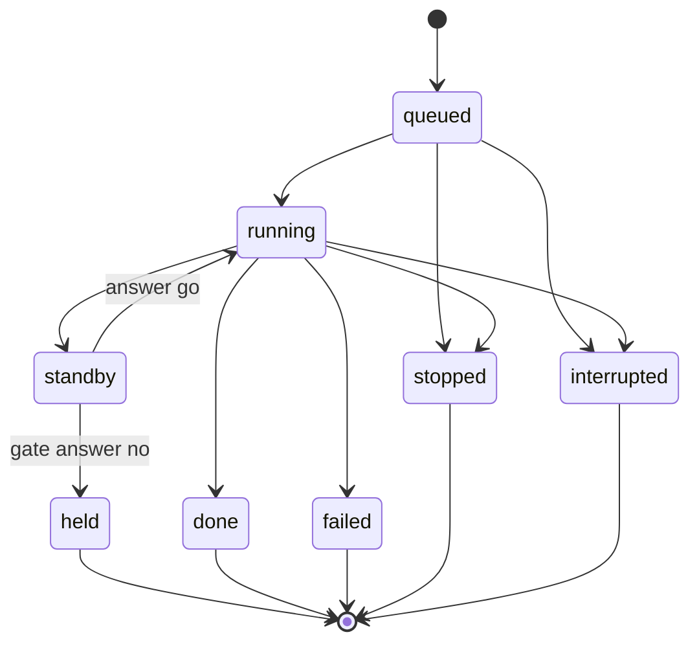
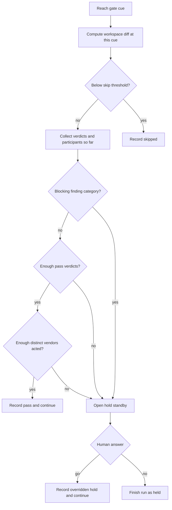

# Run lifecycle and gates

## From request to durable result

Each project owns a single-concurrency FIFO queue. Different project runtimes may progress independently, but runs within one project never overlap. Within a run, Stations and Gates execute in cuesheet order.

The queue emits live events to the bus and appends the same events to disk. Per-run write serialization preserves order and avoids Windows file-lock races. `run.json` is written through a temporary file and rename; `events.jsonl` is append-only and tolerates a damaged final line after a hard kill.

## State model

`held` is terminal. A Gate override continues the current run; declining the override ends it as `held`. Releasing already-held work is a new run, not a resume. A clean shutdown interrupts active and queued work, and boot reconciliation repairs non-terminal records left by a hard kill.

## Station execution

For each Station step, the executor:

1. resolves any cap-driven fallback;
2. verifies the harness exists and the replacement can play the same role;
3. builds the prompt, using a workspace diff plus review instructions for reviewers;
4. creates a leashed workspace and runs the harness;
5. normalizes streamed text, tool, file, cost, denial, and error events;
6. records per-Station cost and the vendor that actually acted;
7. parses reviewer output into verdicts.

Roles are permissions, not prompt personas. The daemon enforces role-level write refusals and path leashes; a harness may additionally declare and apply its own subprocess confinement.

## Gate decision

An unreadable review becomes an abstention, never an approval. `distinct_vendors` counts all Stations that acted, including the author, because a `1-of-1` review with two required vendors has only one reviewer. The diff is the workspace diff at the Gate, so changes from multiple Stations sharing a workspace are not currently attributable to one Station.

## Planned extensions

Per-cue diff attribution, prompt budgets, path-weighted review rules, rewind, and hooks-as-cues are planned. They are not part of the current run contract.
